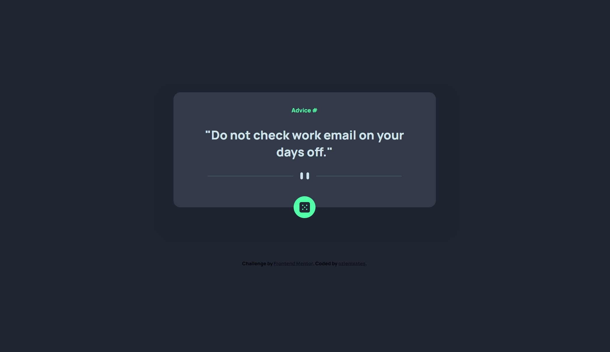
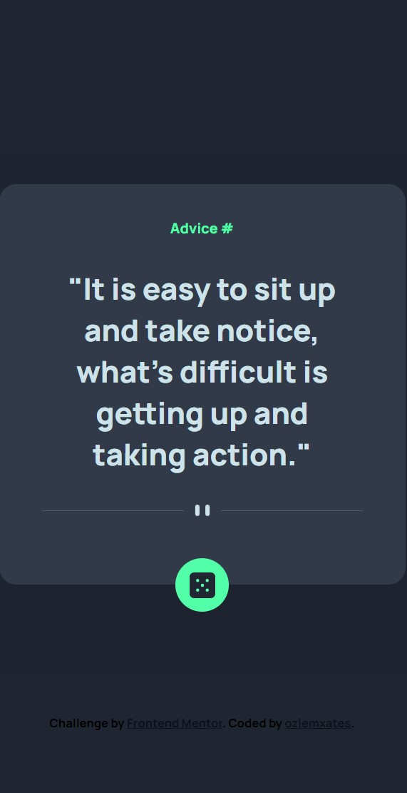

# Frontend Mentor - Advice generator App Solution

Thanks for checking out this front-end coding solution. This is a solution to the [Advice generator app challenge on Frontend Mentor](https://www.frontendmentor.io/challenges/advice-generator-app-QdUG-13db).

## Table of contents

  - [The challenge](#the-challenge)
  - [Screenshot](#screenshot)
  - [Links](#links)
  - [What I learned](#what-i-learned)
  - [Author](#author)

### The challenge

Users should be able to:

- View the optimal layout for the app depending on their device's screen size
- See hover states for all interactive elements on the page
- Generate a new piece of advice by clicking the dice icon 

### Screenshot

### Links

- Solution URL: [Click here](https://www.frontendmentor.io/solutions/advice-generator-app-with-flex-SaV-vOFWCn)
- Live Site URL: [Click here](https://ozlemxates.github.io/Advice-Generator-App-FrontendMentor/)

### What I learned
- Basic JavaScript interactions
- DOM manipulation with JavaScript
- Working with fetch API 

Throughout this challenge, I focused on working with the Fetch API and APIs, while also putting my pre-existing skills into practice. I practiced how to make HTTP requests, handle responses, and parse JSON data. Additionally, I furthered my knowledge in DOM manipulation and dynamic content updates

### Author

- GitHub - [ozlemxates](https://github.com/ozlemxates)
- Frontend Mentor - [@ozlemxates](https://www.frontendmentor.io/profile/ozlemxates)

### Thank you for checking out! 🎉